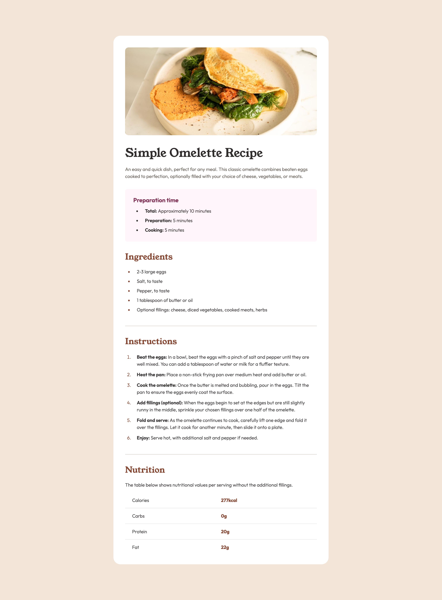

# Frontend Mentor - Recipe page solution

This is a solution to the [Recipe page challenge on Frontend Mentor](https://www.frontendmentor.io/challenges/recipe-page-KiTsR8QQKm). Frontend Mentor challenges help you improve your coding skills by building realistic projects. 

## Table of contents

- [Overview](#overview)
  - [Screenshot](#screenshot)
  - [Links](#links)
- [My process](#my-process)
  - [Built with](#built-with)
  - [What I learned](#what-i-learned)
  - [Continued development](#continued-development)
  - [Useful resources](#useful-resources)
- [Author](#author)


## Overview

### Screenshot



### Links

- Solution URL: [Github repo here](https://github.com/nicholasboyce/recipe-page-main)
- Live Site URL: [Github site here](https://nicholasboyce.github.io/recipe-page-main)

## My process

### Built with

- Semantic HTML5 markup
- CSS custom properties
- Flexbox
- CSS Grid
- Mobile-first workflow

### What I learned

Here's my skip link:

```html
<a href="#main-content" class="skip-link">Go to main content</a>
```
```css
.skip-link {
    position: absolute;
    top: 0;
    left: 0.5rem;
    transform: translateY(-120%);
    transition: transform 300ms ease-in;
    background-color: var(--clr-neutral-600);
    color: var(--clr-neutral-110);
    padding: 1rem 2rem;
}

.skip-link:focus {
    transform: translateY(0);
}
```

### Continued development

I really wanted to review my accessibility understanding in this project, and took a lot of effort to make the design as close as possible while being clear and semantically accurate. I also added a skiplink to get some practice in!

### Useful resources

- [Section element accessibility](https://www.w3.org/WAI/GL/wiki/Using_HTML5_section_element) - This helped me understand the section element and how to make it more accessible.
- [Skip links](https://youtu.be/jDDaOFr9nqQ?si=qDPvukHcXHgn0BfR) - This KP video explained the importance of skip links for me very well.
## Author

- Frontend Mentor - [@nicholasboyce](https://www.frontendmentor.io/profile/nicholasboyce)

